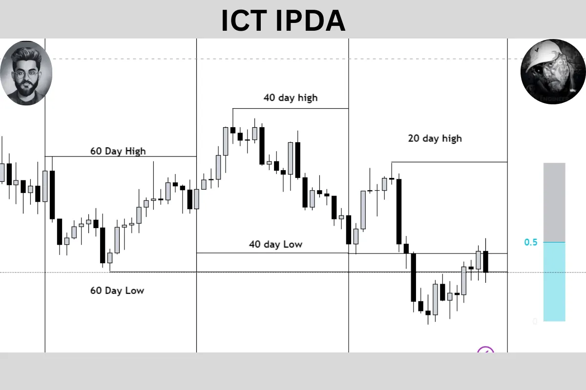
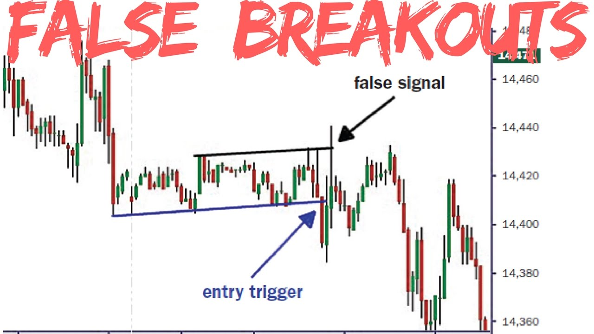

# Bab 1 — Cara Baru Melihat Pasar: SMC, ICT, dan Logika Institusi

> Bab ini adalah fondasi dari seluruh Learning Hub. Sebelum mempelajari market structure, liquidity sweep, BOS, MSS, FVG, atau entry model, kita perlu mengubah cara pandang terhadap chart. Tanpa perubahan cara pandang ini, konsep-konsep berikutnya akan terasa rumit dan terputus-putus.

## Mengapa Bab Ini Penting

Banyak trader pemula belajar pasar dengan cara yang sama: melihat candle, mencari pola, lalu mencoba menebak apakah harga akan naik atau turun. Masalahnya, pendekatan seperti ini sering membuat chart terasa acak. Harga naik sedikit, turun sedikit, breakout lalu balik arah, support ditembus lalu memantul lagi. Akhirnya pasar terlihat seperti sesuatu yang tidak punya logika.

Di sinilah pendekatan **SMC (Smart Money Concepts)** dan **ICT** menjadi berbeda.

Pendekatan ini tidak memulai analisis dari pertanyaan, **“Candle berikutnya naik atau turun?”**  
Pendekatan ini memulai dari pertanyaan, **“Harga sedang mencari apa?”**

Dengan kata lain, kita belajar melihat pasar bukan sebagai kumpulan candle acak, tetapi sebagai **peta likuiditas**, **peta tujuan harga**, dan **jejak aktivitas pelaku besar**.

Kalau fondasi ini sudah kuat, maka bab-bab berikutnya akan terasa jauh lebih mudah dipahami.

---

## Tujuan Pembelajaran

Setelah mempelajari bab ini, pembaca diharapkan mampu:

- memahami perbedaan cara pandang antara trader ritel dan pendekatan SMC/ICT
- memahami mengapa likuiditas menjadi pusat pembacaan harga
- mengenali peran institusi dalam mendorong pergerakan pasar
- memahami mengapa breakout sering menjadi jebakan
- mengenal kerangka dasar **AMD (Accumulation, Manipulation, Distribution)** sebagai ritme sederhana pergerakan harga

---

## 1. Mengubah Cara Pandang terhadap Chart

Cara pandang tradisional yang umum dipakai trader ritel biasanya seperti ini:

- harga naik berarti bullish
- harga turun berarti bearish
- resistance ditembus berarti buy breakout
- support ditembus berarti sell breakout

Masalahnya, pasar tidak selalu bergerak sebersih itu.

Sering kali harga justru menembus level penting hanya untuk mengambil stop loss, lalu berbalik arah. Kadang harga terlihat bullish, tetapi ternyata hanya sedang “mengambil bahan bakar” sebelum turun. Kadang sebuah breakout terlihat sangat meyakinkan, tetapi justru menjadi titik masuk yang paling buruk.

Pendekatan SMC/ICT mengajarkan bahwa chart harus dibaca dengan sudut pandang yang lebih dalam. Harga tidak hanya bergerak karena pola visual, tetapi karena ada **kebutuhan transaksi**. Pelaku besar tidak bisa masuk pasar sembarangan. Mereka membutuhkan lawan transaksi, dan lawan transaksi itu sering terkumpul di area yang mudah ditebak oleh trader ritel.

Karena itu, fokus kita berubah.

Bukan lagi:
**“Pattern apa yang muncul?”**

Tetapi menjadi:
- di mana likuiditas berada?
- siapa yang kemungkinan sedang dijebak?
- apakah harga sedang mengumpulkan order?
- ke mana tujuan harga yang paling logis?

Inilah perubahan besar pertama yang harus dipahami sebelum belajar konsep ICT lebih jauh.

---

## 2. Siapa yang Disebut “Smart Money”?

Istilah **smart money** sering dipakai untuk menyebut pelaku pasar yang memiliki ukuran transaksi jauh lebih besar daripada trader ritel. Mereka bukan sekadar trader yang “lebih pintar”, tetapi pihak yang benar-benar punya dampak terhadap aliran order di pasar.

Secara sederhana, smart money bisa merujuk pada:

- bank dan pelaku interbank
- hedge fund
- institusi besar
- market maker atau penyedia likuiditas

Mengapa mereka penting?

Karena pelaku besar tidak bisa mengeksekusi order besar di sembarang tempat. Semakin besar ukuran order, semakin besar pula kebutuhan akan likuiditas. Mereka membutuhkan cukup banyak lawan transaksi agar order mereka bisa masuk tanpa mengganggu harga secara berlebihan.

Inilah alasan mengapa pasar sering bergerak ke area tertentu terlebih dahulu. Bukan karena “kebetulan”, tetapi karena ada area yang menyediakan order lebih banyak.

Jadi saat kita mempelajari SMC/ICT, kita sedang berusaha membaca pasar dari sisi **mekanisme transaksi**, bukan hanya dari sisi bentuk candle.

---

## 3. Mengapa Harga Bergerak? Jawabannya: Likuiditas

Ini adalah ide paling penting dalam bab ini.

Harga sering bergerak menuju area yang menyimpan likuiditas.

**Likuiditas** secara praktis bisa dipahami sebagai area tempat banyak order berkumpul. Di situlah stop loss, pending order, breakout entry, atau reaksi trader ritel biasanya menumpuk. Bagi pelaku besar, area seperti ini menarik karena menyediakan lawan transaksi yang mereka butuhkan.

Bayangkan sebuah institusi ingin membeli dalam jumlah besar. Mereka membutuhkan banyak penjual. Di mana penjual cenderung muncul? Sering kali di area yang baru saja ditembus, di area panic selling, atau di area stop loss seller terkumpul.

Begitu juga sebaliknya. Jika institusi ingin menjual dalam ukuran besar, mereka memerlukan banyak pembeli. Pembeli sering muncul di area breakout bullish, di resistance yang baru ditembus, atau setelah pasar terlihat sangat meyakinkan naik.

Karena itu, area-area berikut menjadi penting:

- **swing high**
- **swing low**
- **equal highs**
- **equal lows**
- **previous day high / previous day low**
- area breakout yang terlalu jelas
- level support dan resistance yang dilihat banyak orang

Semua area ini sering disebut sebagai **liquidity pools**.

### Inti yang perlu dipahami
Harga tidak selalu bergerak karena ingin “trend”.  
Sering kali harga bergerak karena ingin **mengambil likuiditas terlebih dahulu**.

Kalau kamu mulai memahami ini, maka banyak pergerakan yang sebelumnya terlihat aneh akan mulai terasa masuk akal.

---

## 4. IPDA: Melihat Harga sebagai Perpindahan dari Satu Tujuan ke Tujuan Lain

Dalam tradisi ICT, ada istilah **IPDA (Interbank Price Delivery Algorithm)**. Bagi pemula, istilah ini kadang terdengar terlalu teknis. Namun gagasan dasarnya sebenarnya cukup sederhana.

IPDA membantu kita melihat bahwa harga seolah bergerak dengan tujuan:
- mencari likuiditas
- menutup ketidakseimbangan
- berpindah dari satu area order ke area order lain

Artinya, pasar tidak dibaca sebagai gerakan liar tanpa arah. Pasar dibaca sebagai **proses distribusi harga** yang berpindah dari satu titik kepentingan ke titik kepentingan berikutnya.

Sudut pandang ini sangat membantu karena membuat kita berhenti bertanya:

**“Apakah ini candle bagus untuk entry?”**

dan mulai bertanya:

- harga datang dari mana?
- harga sedang menuju ke mana?
- area mana yang belum disentuh?
- likuiditas mana yang masih tersisa?

Dengan kata lain, kita belajar membaca **narasi harga**, bukan hanya bentuk visual chart.

---

## 5. Mengapa Pasar Sering Terlihat Menipu?

Salah satu alasan mengapa banyak trader gagal adalah karena mereka terlalu percaya pada tampilan permukaan chart.

Misalnya:
- resistance ditembus → dianggap breakout valid
- low ditembus → dianggap bearish continuation
- candle impulsif muncul → dianggap momentum murni

Padahal dalam banyak kasus, pergerakan itu justru adalah **jebakan**.

Mengapa jebakan ini terjadi?

Karena trader ritel cenderung bereaksi di tempat yang sama:
- buy saat breakout high
- sell saat breakdown low
- meletakkan stop loss di atas swing high atau di bawah swing low
- masuk terlalu cepat saat ada candle kuat

Akibatnya, pasar memiliki area yang sangat “kaya” akan likuiditas. Area itu kemudian menjadi target yang menarik.

Maka muncullah fenomena seperti:
- breakout lalu balik arah
- stop loss diambil dulu baru harga jalan
- support/resistance ditembus sesaat sebelum reversal
- harga membuat gerakan salah arah sebelum bergerak ke arah utamanya

Ini bukan berarti pasar selalu “jahat”, tetapi pasar memang bergerak dengan logika order flow, bukan dengan logika kenyamanan trader ritel.

### Pelajaran penting
Jangan langsung percaya pada gerakan pertama yang terlihat meyakinkan.  
Sering kali gerakan pertama hanyalah proses mengambil likuiditas sebelum pergerakan sesungguhnya dimulai.

---

## 6. Power of Three (AMD): Ritme Dasar Pergerakan Harga

Salah satu model paling penting dalam ICT adalah **Power of Three**, yang juga dikenal dengan singkatan **AMD**:

1. **Accumulation**
2. **Manipulation**
3. **Distribution**

Model ini penting karena memberi kita kerangka sederhana untuk memahami bagaimana harga sering bergerak.

### 1) Accumulation
Pada fase ini, harga cenderung bergerak dalam range. Pergerakan terlihat sempit, kadang membosankan, dan belum menunjukkan arah yang jelas. Namun justru di fase inilah likuiditas mulai terkumpul.

Banyak trader pemula tidak sabar di fase ini karena merasa “tidak ada apa-apa”. Padahal fase ini sangat penting karena menjadi dasar dari langkah berikutnya.

### 2) Manipulation
Setelah likuiditas cukup terkumpul, harga sering bergerak ke arah yang salah terlebih dahulu. Tujuannya bisa untuk:
- mengambil stop loss
- memancing breakout trader
- menciptakan ilusi arah pasar

Inilah fase yang paling sering membuat trader masuk terlalu cepat. Mereka mengira arah sudah jelas, padahal harga baru saja melakukan penyapuan likuiditas.

### 3) Distribution
Setelah likuiditas diambil, harga kemudian bergerak ke arah tujuan utamanya dengan momentum yang lebih jelas. Di fase inilah arah pasar biasanya mulai terlihat lebih “jujur”.

### Kenapa model AMD penting?
Karena model ini mengajarkan bahwa:
- pasar tidak selalu langsung bergerak ke arah utama
- sering ada fase jebakan sebelum distribusi nyata
- range, sweep, dan expansion sering saling terhubung

Kalau kamu memahami AMD, maka kamu tidak akan terlalu mudah tertipu oleh gerakan awal pasar.

---

## 7. Cara Berpikir yang Benar Saat Membuka Chart

Sebelum mencari entry, biasakan bertanya seperti ini:

### Pertanyaan pertama: di mana likuiditas terdekat?
Lihat area high, low, equal highs, equal lows, dan level penting hari sebelumnya.

### Pertanyaan kedua: apakah likuiditas itu sudah diambil?
Kalau belum, ada kemungkinan harga masih tertarik menuju area itu.

### Pertanyaan ketiga: apakah pasar masih mempertahankan struktur, atau mulai berubah?
Di sinilah konsep market structure nanti akan menjadi sangat penting.

### Pertanyaan keempat: adakah displacement atau gerakan kuat yang menunjukkan niat pasar?
Gerakan impulsif tertentu sering memberi petunjuk bahwa ada partisipasi yang lebih besar.

### Pertanyaan kelima: apakah ini terjadi di waktu yang logis?
Waktu juga penting. Tidak semua gerakan memiliki kualitas yang sama. Sesi London dan New York, misalnya, sering menjadi waktu yang lebih aktif dibanding jam-jam sepi.

Kerangka berpikir seperti ini akan membuat analisis menjadi lebih terarah dan tidak emosional.

---

## 8. Kesalahan Umum Trader Pemula

Sebelum menutup bab ini, penting untuk mengenali beberapa kesalahan yang paling sering terjadi:

- menganggap setiap breakout sebagai sinyal valid
- masuk hanya karena candle terlihat kuat
- menaruh stop loss di area yang terlalu mudah ditebak
- mengejar harga karena takut ketinggalan
- terlalu fokus pada indikator, tetapi tidak memahami konteks likuiditas
- membaca chart sepotong-sepotong tanpa memahami tujuan harga

Kesalahan-kesalahan ini bukan terjadi karena trader bodoh, tetapi karena mereka belum memiliki kerangka baca yang benar.

Dan itulah fungsi bab ini: membangun kerangka tersebut.

---

## 9. Ringkasan Bab

Inti Bab 1 bukanlah mencari setup, melainkan **mengubah cara berpikir**.

Setelah bab ini, pembaca seharusnya mulai memahami bahwa:

- pasar tidak seacak yang terlihat
- harga sering bergerak menuju likuiditas
- pelaku besar membutuhkan area order yang cukup untuk mengeksekusi transaksi
- breakout yang terlihat jelas belum tentu valid
- pasar sering melalui ritme **accumulation → manipulation → distribution**
- chart perlu dibaca sebagai **narasi tujuan harga**, bukan sekadar bentuk candle

Kalau fondasi ini sudah kuat, maka bab-bab berikutnya seperti market structure, BOS, MSS, liquidity sweep, fair value gap, dan execution akan terasa jauh lebih logis.

---

## Penutup

Bab ini adalah perubahan sudut pandang.

Sebelum mempelajari teknik, kita harus terlebih dahulu belajar **cara melihat**.  
Karena dalam trading, cara melihat pasar akan menentukan cara berpikir, dan cara berpikir akan menentukan kualitas keputusan.

Jika trader masih melihat chart sebagai kumpulan candle acak, maka semua konsep lanjutan akan terasa membingungkan.  
Tetapi jika trader mulai melihat chart sebagai peta likuiditas dan tujuan harga, maka pasar akan mulai terlihat jauh lebih terstruktur.

---

## Catatan

Materi ini bersifat edukatif dan bukan rekomendasi finansial. Gunakan sebagai kerangka analisis dan pembelajaran, bukan sebagai janji hasil trading.