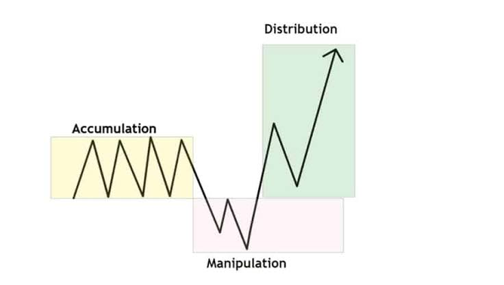

# Bab 6 — AMD: Accumulation, Manipulation, Distribution
> "Pasar jarang sekali bergerak secara lurus dan jujur. Salah satu model paling fundamental dalam tradisi ICT adalah **Power of Three**, yang sering disingkat sebagai **AMD**: *Accumulation*, *Manipulation*, dan *Distribution*. Model ini sangat krusial karena membantu pembaca melihat ritme dasar 'napas' pergerakan harga dengan cara yang terstruktur, sederhana, namun sangat mematikan bagi mereka yang tidak memahaminya."

## Mengapa Bab Ini Penting
Mayoritas trader pemula melihat market seolah bergerak secara linear (lurus dan logis):
 * Harga sedang naik memantul *support* → Berarti saatnya *Buy*.
 * Harga sedang turun menembus *support* → Berarti saatnya *Sell*.
Masalah besarnya adalah, market hampir tidak pernah bergerak sejujur dan semulus itu. Jika trading hanya soal melihat panah naik dan turun, semua orang sudah menjadi jutawan.
Sering kali, sebelum harga benar-benar bergerak berekspansi ke arah tujuan utamanya, market justru melakukan skenario ini:
 * Bergerak sangat sempit dan membosankan (*sideways*).
 * Tiba-tiba menyapu batas atas/bawah untuk memakan likuiditas (*Stop Loss*).
 * Membuat gerakan tipuan agresif seolah arah tren sudah pasti.
 * Baru setelah kepanikan terjadi, harga berbalik arah dan menunjukkan tujuan yang sebenarnya.
Konsep AMD membantu Anda menyusun semua anomali dan gerakan menipu tersebut ke dalam **satu kerangka kerja yang mudah dipahami dan diantisipasi**.

## Tujuan Pembelajaran
Setelah mempelajari bab ini, pembaca diharapkan mampu:
 * memahami definisi dan fungsi dari tiga fase dasar AMD (Akumulasi, Manipulasi, Distribusi)
 * melihat benang merah dan hubungan sebab-akibat antara area *range*, gerakan tipuan, dan ekspansi harga
 * memahami alasan logis dan teknis mengapa gerakan awal pembukaan pasar sering kali menipu
 * menggunakan AMD sebagai kacamata utama untuk membaca ritme market dengan jauh lebih sabar dan tertib

## 1. Apa Itu AMD? (The Power of Three)
AMD adalah singkatan dari tiga fase kehidupan sebuah pergerakan harga:
 1. **A**ccumulation (Akumulasi / Pengumpulan)
 2. **M**anipulation (Manipulasi / Jebakan)
 3. **D**istribution (Distribusi / Perjalanan Utama)
Model ini menjelaskan bahwa market selalu melalui tiga fase besar secara berurutan sebelum dan saat pergerakan tren utama (*Delivery*) terbentuk. AMD bukan satu-satunya cara membaca market, tetapi ia adalah model yang sangat ampuh karena sederhana dan terhubung langsung dengan hukum dasar likuiditas.

## 2. Accumulation (Fase Pengumpulan Bahan Bakar)
### Apa itu?
*Accumulation* adalah fase tenang ketika harga cenderung bergerak dalam sebuah *range* (kotak) yang sempit. Pergerakan terlihat lambat, terbatas, kadang sangat membosankan, dan sama sekali belum menunjukkan arah tren yang benar-benar jelas.
### Kenapa penting?
Jangan tertipu oleh kebosanannya, karena justru di fase inilah **likuiditas mulai diternakkan dan dikumpulkan**.
Pada fase ini, trader ritel sering kali:
 * Mulai menggambar batas *support* dan *resistance* kecil dari *range* tersebut.
 * Mulai meletakkan *Stop Loss* secara rapi di atas batas *High* dan di bawah batas *Low* kotak tersebut.
 * Mulai membangun ekspektasi emosional untuk bersiap melakukan *Entry Breakout*.
Dengan kata lain, *Accumulation* adalah fase ketika market sedang “mengisi bahan bakar” dengan cara menumpuk order publik.
### Ciri-ciri Umum:
 * Pergerakan (*range*) relatif sempit dan konsolidatif.
 * Belum ada *Delivery* (dorongan institusi) yang dominan ke satu arah.
 * *High* dan *Low range* mulai terbentuk dengan sangat jelas di mata telanjang.
 * Trader pemula mudah bosan atau justru terlalu cepat menebak-nebak arah penembusannya.

## 3. Manipulation (Jebakan Ilusi Arah)
### Apa itu?
*Manipulation* adalah fase "berdarah" ketika harga tiba-tiba meledak bergerak ke **arah yang salah** terlebih dahulu, atau sengaja ke arah yang menipu, tepat sebelum market bergerak ke arah utamanya.
### Kenapa penting?
Fase ini sangat esensial bagi *Smart Money* dan sering dipakai secara algoritmik untuk:
 * Mengambil *Stop Loss* yang terkumpul di fase *Accumulation* tadi.
 * Memancing *Breakout Trader* agar masuk posisi dengan keyakinan penuh.
 * Menciptakan ilusi visual (misal: *Candle* tebal tertutup di luar kotak) tentang arah tren hari itu.
 * Menyerap likuiditas yang mutlak dibutuhkan untuk mengeksekusi order raksasa mereka.
Fase inilah yang paling sering membuat trader ritel menangis dan merasa market itu “jahat”, “curang”, atau “tidak masuk akal”. Padahal, jika Anda melihatnya dari sudut pandang mesin pencari likuiditas, tindakan manipulasi ini **sangat logis dan efisien**.
### Ciri-ciri Umum:
 * Terjadi *Sweep* (sapuan) tajam ke salah satu sisi (atau kedua belah sisi) dari batas *range*.
 * Ada penembusan level *obvious* yang terlihat sangat impulsif.
 * Jutaan trader ritel FOMO dan masuk pasar terlalu cepat mengikuti arah panah tipuan.
 * Market terlihat seolah-olah sudah "resmi" memilih arah tren, padahal belum tentu demikian.

## 4. Distribution (Perjalanan Menuju Target Asli)
### Apa itu?
*Distribution* adalah fase akhir ketika harga—setelah sukses memakan likuiditas di fase manipulasi—akhirnya berbalik dan mulai bergerak tajam menuju area target utamanya dengan momentum yang jauh lebih bersih.
### Kenapa penting?
Setelah likuiditas diambil secara paksa melalui *Manipulation*, market (Institusi) kini biasanya sudah mengantongi order yang cukup, dan ruang harga sudah dibersihkan. Di fase inilah ekspansi harga terjadi dan arah pasar sering mulai terlihat lebih "jujur".
### Ciri-ciri Umum:
 * Ada dorongan (*Displacement*) yang jauh lebih tegas dan terarah.
 * Tren mulai terbentuk dengan konfirmasi *Market Structure Shift* (MSS) yang jelas.
 * Market tidak lagi sekadar menyapu level-level kecil bolak-balik.
 * *Delivery* (pengantaran harga) menuju target likuiditas magnet berikutnya (*Draw on Liquidity*) mulai terasa nyata dan stabil.

## 5. Tabel Anatomi Siklus AMD
Untuk mempermudah ingatan visual Anda saat melihat chart, perhatikan tabel perbandingan fase berikut:
| Fase Siklus | Bentuk Visual di Chart | Tindakan Trader Ritel | Tindakan Smart Money (Institusi) |
|---|---|---|---|
| **Accumulation** | *Sideways*, harga mondar-mandir dalam area sempit. | Menebak arah *breakout*, menaruh SL di atas/bawah area. | Membangun posisi secara perlahan, membiarkan order ritel menumpuk. |
| **Manipulation** | *Breakout* palsu yang tajam (*Fakeout/Judas Swing*). | *Entry* FOMO searah *breakout*, terkena SL secara massal. | Menyerang kolam likuiditas untuk mengisi bahan bakar (menyerap pesanan). |
| **Distribution** | Tren kuat berlawanan dengan arah manipulasi awal. | Panik, bingung, atau memaksakan *reversal* (melawan arah). | Merealisasikan profit dengan mengantar harga ke target utama sesungguhnya. |

## 6. Kenapa AMD Sangat Berguna?
Karena pemahaman terhadap model ini membantu "mencuci otak" trader dari kebiasaan buruk yang reaktif, menjadi analis yang antisipatif. Anda akan menyadari bahwa:
 * Market **tidak dilarang** untuk bergerak lurus, tetapi sangat jarang langsung menuju arah utamanya tanpa tipuan.
 * Area *Range/Sideways* bukanlah waktu yang terbuang percuma, melainkan sebuah pertunjukan pengumpulan amunisi.
 * Penembusan sesaat (*Sweep*) sering kali murni menjadi bagian integral dari proses pasar, bukan gangguan acak.
 * Gerakan tipuan agresif adalah hal yang sangat normal dari pembentukan *move* (ayunan) yang lebih besar.
Dengan kacamata AMD, trader akan dipaksa untuk jauh lebih **sabar duduk di kursi penonton** hingga jebakan selesai dimainkan.

## 7. Hubungan AMD dengan Siklus Likuiditas
Model AMD tidak bisa dipisahkan dari konsep likuiditas yang sudah kita bahas di Bab 3 dan 4.
 * **Dalam Accumulation:** Kolam likuiditas (*Buy Stop, Sell Stop, Stop Loss*) secara harfiah sedang diternakkan dan dikumpulkan di batas atas dan bawah *range*.
 * **Dalam Manipulation:** Likuiditas yang sudah matang itu "dipanen" secara paksa melalui *sweep* atau tusukan gerakan tipuan.
 * **Dalam Distribution:** Harga yang sudah kenyang bahan bakar kini mulai didistribusikan bergerak menuju target utama (*Liquidity Pool* di *timeframe* yang lebih besar) setelah volume yang diperlukan tersedia.
Jadi, AMD bukan hanya sekadar model ritme atau pola bentuk candle. AMD adalah **cetak biru algoritma dari logika order dan pengantaran likuiditas (Liquidity Delivery)**.

## 8. Kesalahan Umum Trader Ritel di Fase AMD
Waspadai jebakan psikologis berikut saat Anda sedang membaca siklus AMD:
### 1) Menganggap Accumulation sebagai Fase "Tidak Penting"
Banyak trader mematikan layar saat market *sideways* karena merasa bosan. Padahal justru di sanalah kerangka utama dari jebakan dan target sedang dirancang.
### 2) Mengira Manipulation adalah Arah Final (Tertipu Breakout)
Akibat terbawa emosi melihat *candle* tebal, trader masuk pasar terlalu cepat mengikuti penembusan awal, dan berakhir menjadi korban "sate" di dalam perangkap.
### 3) Tidak Sabar Menunggu Fase Distribution
Alih-alih menunggu konfirmasi struktur harga berbalik arah setelah manipulasi selesai, trader justru ragu-ragu dan takut ketinggalan kapal. Padahal fase *Distribution*-lah yang biasanya memberikan *entry* yang jauh lebih bersih dan rendah risiko.
### 4) Menggunakan AMD Secara Terlalu Kaku dan Geometris
AMD adalah kerangka prinsip bacaan *order flow*, bukan pola *chart* yang wajib selalu muncul dengan ukuran kotak dan jarum yang sempurna simetris setiap harinya.

## 9. Glosarium Singkat Bab 6
 * **PO3 (Power of Three):** Konsep utama bahwa setiap penciptaan *candle* atau pergerakan harga memiliki 3 nyawa: *Accumulation, Manipulation, Distribution*.
 * **Range / Consolidation:** Rentang batas atas dan batas bawah harga di saat minat pasar sedang seimbang.
 * **Fakeout / False Breakout:** Penembusan harga ke luar dari batas *support/resistance* yang ternyata hanya tipuan manipulasi sesaat.
 * **Delivery:** Proses bergeraknya harga dengan momentum stabil dari satu titik likuiditas ke titik likuiditas lainnya.

## 10. Ringkasan Bab
Inti sari dari bab ini adalah:
 * Market tidak bergerak linear; ia menari lewat ritme terstruktur: *Accumulation* (Membangun), *Manipulation* (Menghancurkan/Menipu), lalu *Distribution* (Melanjutkan).
 * Area *Range/Sideways* bukan sekadar fase harga kosong, melainkan pabrik tempat likuiditas ditumpuk.
 * Manipulasi pasar bukan berarti ada konspirasi melawan Anda pribadi, tetapi murni proses algoritma yang diperlukan untuk mengambil likuiditas.
 * Distribusi adalah panggung sesungguhnya ketika arah harga mulai terlihat lebih jelas untuk diikut.
 * Kerangka AMD membantu merombak mental trader agar mampu memandang *market* dengan jauh lebih sabar, logis, dan analitis.

## Penutup
*AMD adalah salah satu filter kacamata terbaik untuk menyadarkan Anda bahwa market tidak pernah bergerak lurus, dan sama sekali tidak memiliki kewajiban untuk jujur sejak menit pertama sesi dibuka. Kalau pembaca sudah menyatu dengan logika AMD, maka ribuan gerakan pasar yang sebelumnya di masa lalu terasa bagai jebakan kejam dan menipu, akan mulai terlihat di mata Anda sebagai bagian dari ritme simfoni transaksi yang sangat masuk akal.*

## Catatan
*Materi ini murni bersifat edukatif untuk memperkaya kerangka analisis struktural, dan bukan merupakan ajakan, sinyal, atau rekomendasi finansial riil. Gunakan model ini sebagai peta navigasi untuk melatih kesabaran Anda, bukan sebagai jaminan bahwa masa depan harga dapat diprediksi secara sempurna tanpa perlindungan risiko.*
