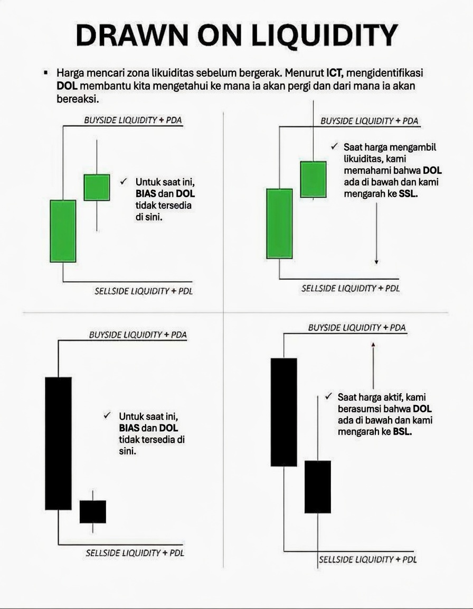
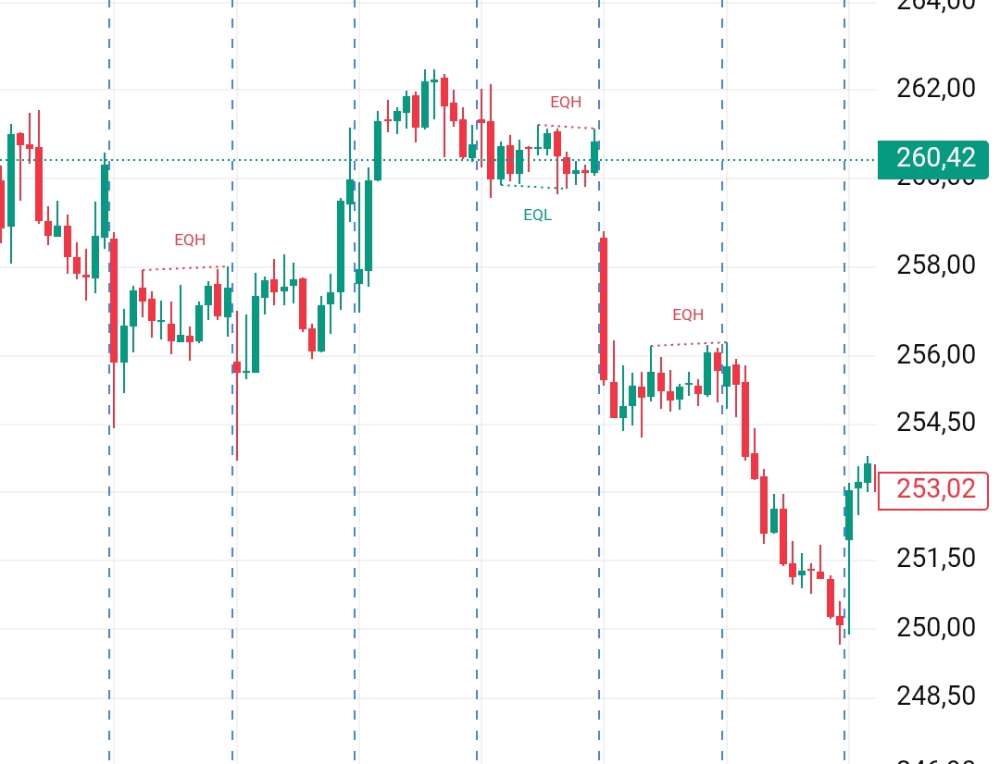
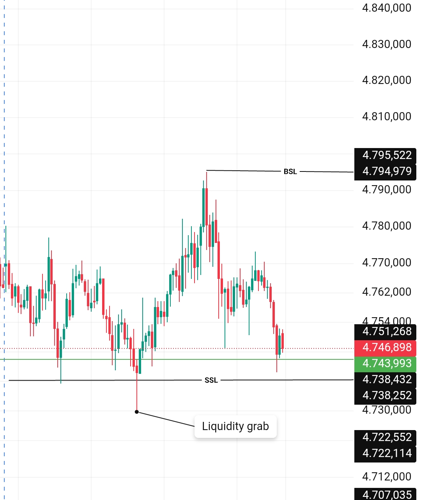

# Bab 7 — Mengapa Market Terlihat Acak Padahal Sedang Berpindah Target
> "Banyak trader pemula sering merasa putus asa karena menganggap pergerakan harga di pasar sangat acak, liar, dan tidak dapat diprediksi. Padahal, jika kita melepas kacamata indikator dan melihatnya dari sudut pandang *order flow* yang mendalam, kita akan menyadari bahwa pergerakan harga itu adalah **sebuah proses terstruktur yang sedang berpindah dari satu target (tujuan) ke target yang lain**. Di bab ini, kita akan membongkar ilusi keacakan tersebut."

## Mengapa Bab Ini Penting
Mayoritas trader sering kali gagal mengenali tujuan akhir dari sebuah pergerakan harga karena mereka terlalu sibuk memelototi pola *candle* demi *candle* (seperti *doji* atau *engulfing*) yang muncul di layar. Di mata mereka, setiap lonjakan harga adalah "sinyal", dan setiap penurunan adalah "ancaman".
Padahal, tujuan utama dari pergerakan harga yang sering terlihat "liar" tersebut sering kali murni hanya untuk **mengambil Liquidity** dari area-area yang sudah diprediksi sebelumnya oleh algoritma pasar.
Trader yang berhasil memahami logika perpindahan target pasar ini akan mampu mengidentifikasi **arah tujuan harga sesungguhnya (Draw on Liquidity)**. Hasilnya, mereka tidak lagi panik oleh riak kecil di *timeframe* rendah, dan menjadi jauh lebih akurat dalam memilih POI (*Point of Interest*) yang tepat untuk *entry*.

## Tujuan Pembelajaran
Setelah mempelajari bab ini, pembaca diharapkan mampu:
 * mendekonstruksi mitos bahwa pasar bergerak secara acak tanpa tujuan
 * memahami secara teknis bahwa pasar hanya bergerak dengan satu misi utama: mengumpulkan *Liquidity*
 * mengidentifikasi **tujuan harga** yang lebih besar (*Higher Timeframe Narrative*) berdasarkan struktur pasar
 * memetakan perpindahan target harga dari satu *Liquidity Pool* ke *Liquidity Pool* berikutnya
 * menghindari rasa frustrasi akibat tidak paham mengapa harga tiba-tiba berbalik arah

## 1. Pergerakan Harga Bukan Acak
Pasar finansial bernilai triliunan dolar tidak bergerak hanya karena ia sedang "ingin naik" atau "ingin turun". Tidak ada ruang untuk kebetulan. Setiap pergerakan harga selalu memiliki tujuan bisnis tertentu yang mendasarinya.
Tujuan algoritmik ini biasanya berupa:
 * Mengambil *Liquidity* (uang / *Stop Loss*) dari area tertentu untuk memenuhi kuota pesanan institusi.
 * Mengatur ulang (*reset*) posisi trader ritel yang terlalu mendominasi di level tertentu.
 * Membawa harga kembali ke level yang dianggap rasional atau efisien (*Fair Value*) sebelum melanjutkan tren.

## 2. Tujuan Harga dalam Pasar (Magnet Liquidity)
Pasar adalah sebuah mesin pencari uang. Ia selalu bergerak menuju **Liquidity Pools** yang mengendap di sekitar **level-level penting**. Area-area target ini meliputi:
 * **Previous Highs** atau **Previous Lows** (Puncak/Dasar periode sebelumnya)
 * **Breakout Levels** yang terlalu jelas dan dipantau jutaan pasang mata
 * **Old Highs / Old Lows** (Puncak/Dasar historis)
 * **Equal Highs / Equal Lows** (Puncak/Dasar ganda yang terlihat seperti tembok kuat)

Harga akan dengan sengaja diarahkan ke area-area ini untuk mengumpulkan order dari trader yang sudah melakukan kesalahan taktis, seperti **menaruh Stop Loss di tempat yang paling mudah ditebak**.

### Contoh Mekanisme Target
Jika pasar bergerak stabil dari 2400 ke 2412, lalu tiba-tiba meledak **melakukan breakout ke 2420**, tujuan utama dari *breakout* tajam ini bukanlah untuk terbang ke bulan, melainkan untuk **menguji kondisi Liquidity** di atas level rentang 2410 dan 2420.
 * Trader ritel yang menaruh *Stop Loss* Sell mereka di **2410** atau **2420** akan disapu bersih (dipaksa keluar dari posisi mereka).
 * Setelah *Liquidity* ini sukses dieksekusi (target tercapai), harga tidak punya alasan lagi untuk naik, dan bisa dengan cepat **berbalik arah** bergerak ke bawah. Inilah yang sering Anda sebut sebagai *Fakeout* (Jebakan).

## 3. Tabel Perbandingan: Ilusi Acak vs Peta Tujuan
| Sudut Pandang | Market Dianggap "Acak" (Ritel) | Market Memiliki "Tujuan" (SMC/ICT) |
|---|---|---|
| **Melihat Ayunan Harga** | Harga naik-turun tanpa alasan yang jelas (Bising/Noise). | Harga sedang berjalan dari *Liquidity Pool* A menuju *Liquidity Pool* B. |
| **Reaksi terhadap Level** | Panik saat *support/resistance* hancur tiba-tiba. | Menyadari bahwa level tersebut memang sudah ditargetkan untuk dihancurkan. |
| **Kondisi Sideways** | Market sedang mati, tidak tahu arah. | Market sedang bersiap-siap (*Accumulation*) sebelum menuju target berikutnya. |

## 4. Market adalah Proses yang Terstruktur
Pasar tidak pernah sekadar bergerak karena ingin melakukan *breakout* atau *reversal* tanpa skenario. Setiap titik pergerakan harga adalah bagian terkecil dari **proses distribusi harga** yang jauh lebih besar.
Proses ini biasanya diatur dalam beberapa tahap berulang (seperti yang telah kita bahas di materi AMD):
 1. **Accumulation** – Proses pengumpulan order ritel yang terkurung di area tertentu.
 2. **Manipulation** – Pergerakan palsu untuk pengujian *Liquidity* di area terlemah (sapuan *Stop Loss*).
 3. **Distribution** – Pergerakan harga yang sebenarnya menuju **tujuan yang lebih besar**.
Jika kita dapat melatih mata kita untuk melihat fase-fase ini, kita bisa secara proaktif mengenali kapan market sedang **siap bergerak menuju target makro**, atau kapan ia sekadar melakukan *retrace* (koreksi) minor untuk mencari tenaga tambahan.

## 5. Cara Mengidentifikasi Tujuan Harga
Untuk mengidentifikasi ke mana arah tujuan harga selanjutnya, kita tidak bisa hanya menebak-nebak. Kita perlu melihat dan merangkai beberapa elemen kunci:
 * **Struktur Pasar:** Apakah harga secara makro sedang dalam kondisi tren (*trending*) atau sedang dalam fase mondar-mandir (*ranging*)?
 * **Peta Liquidity:** Di mana letak *Stop Loss* dan *Pending Order* yang belum tersentuh di sekitar level-level penting?
 * **Higher Timeframe (HTF):** Ini adalah kompas utama. Anda wajib melihat *Timeframe* besar (seperti H4 atau Daily) untuk melihat "Tujuan Besar" dari harga, agar tidak tersesat oleh riak di *timeframe* kecil (M5/M15).

### Contoh Analisis Multi-Timeframe
Kembali ke XAU/USD. Jika di *timeframe* kecil kita melihat harga bergejolak di atas **2400** dan akhirnya mengalami *breakout* ke **2410**, kita tidak boleh langsung menyimpulkan arah di sana.
Kita harus *zoom-out*. Jika dari *Timeframe Daily* terlihat bahwa ada **Draw on Liquidity yang jauh lebih besar** yang masih menggantung utuh di level **2430** atau bahkan **2450**, maka seluruh gejolak di bawah tadi (analisis struktur dan *Liquidity*) hanyalah batu loncatan market untuk menuju target 2450 tersebut.

## 6. Menghindari Pemahaman Pasar yang Salah
Salah satu kesalahan intelektual terbesar yang dilakukan oleh trader pemula adalah menyerah dan menganggap bahwa pergerakan harga itu murni acak, liar, dan tanpa tujuan. Pikiran "pasrah" ini membuat eksekusi mereka menjadi seperti orang berjudi.
Padahal, dengan meyakini dan memahami bahwa harga selalu memiliki **Target Liquidity**, kita bisa dengan mudah menghindari jebakan *breakout* manipulatif dan lebih sabar menyiapkan diri untuk *entry* pada *Point of Interest* (POI) yang benar-benar searah dengan niat algoritma pasar.
Trader yang sudah menguasai cara membaca **Draw on Liquidity makro** akan memiliki keunggulan psikologis: mereka jauh lebih mudah memprediksi ke mana magnet harga akan bergerak selanjutnya, dan tahu kapan waktu yang paling logis untuk masuk ke medan pertempuran.

## 7. Glosarium Singkat
 * **Draw on Liquidity (DOL):** Daya tarik magnetik pasar; area target *Liquidity* terdekat di mana harga kemungkinan besar akan bergerak menujunya.
 * **Higher Timeframe (HTF) Narrative:** Cerita atau tren utama yang sedang terjadi di grafik jangka waktu besar (Daily/H4), yang bertindak sebagai "bos" penentu arah.
 * **Fair Value / Repricing:** Kebutuhan market untuk kembali ke titik keseimbangan harga setelah pergerakan yang terlalu agresif (*Imbalance*).
 * **Inducement:** Area struktur palsu yang sengaja dibuat market untuk menggoda ritel agar masuk posisi, sebelum harga menuju target POI sesungguhnya.

## 8. Ringkasan Bab
Inti sari dan kesimpulan dari bab ini adalah:
 * Pasar tidak pernah bergerak secara acak. Kebisingan di *timeframe* kecil hanyalah ilusi.
 * Setiap pergerakan harga mutlak memiliki tujuan bisnis yang lebih besar (memburu order / *Liquidity*).
 * Target harga hampir selalu merupakan *Liquidity Pools* (Old High/Low, Equal High/Low).
 * Dengan memadukan struktur pasar dan lensa *Higher Timeframe* (HTF), trader bisa memetakan ke mana algoritma akan pergi selanjutnya.
 * Berhenti melihat pergerakan harga semata-mata sebagai panah "Naik" atau "Turun". Mulailah membaca chart sebagai bagian dari **narasi pengantaran harga (Price Delivery)** yang sangat presisi.

## Penutup
*Saat seorang trader akhirnya mengalami 'klik' dan mulai memahami dengan jernih **tujuan akhir dari pergerakan harga**, mereka secara otomatis tidak akan lagi mudah dipusingkan atau dijebak oleh **gerakan acak** di timeframe kecil. Sebaliknya, mereka akan mampu berdiri di atas bukit, melihat medan pertempuran pasar dengan sangat jelas, mengidentifikasi ke mana arah mangsa bergerak, dan mengambil keputusan eksekusi yang jauh lebih dingin dan bijaksana.*

## Catatan
*Materi ini murni bersifat edukatif untuk memperkuat kerangka analitis struktural, dan bukan merupakan rekomendasi finansial atau jaminan keuntungan. Gunakan konsep "Draw on Liquidity" ini untuk melatih mata Anda membaca narasi pasar pada saat melakukan proses backtesting.*
