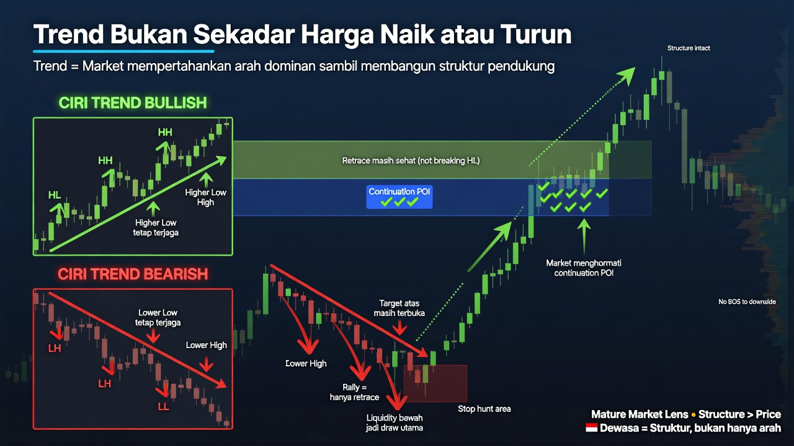
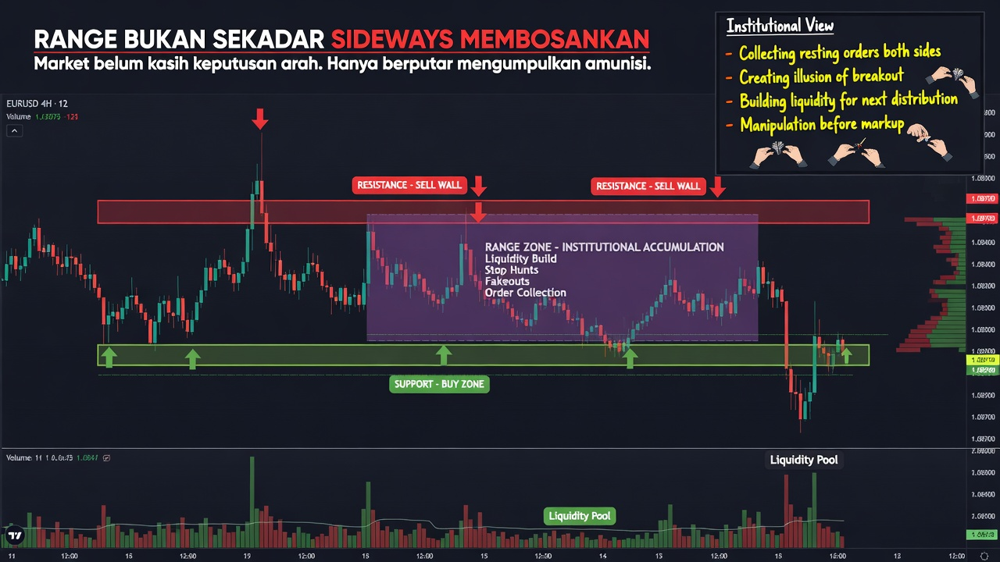
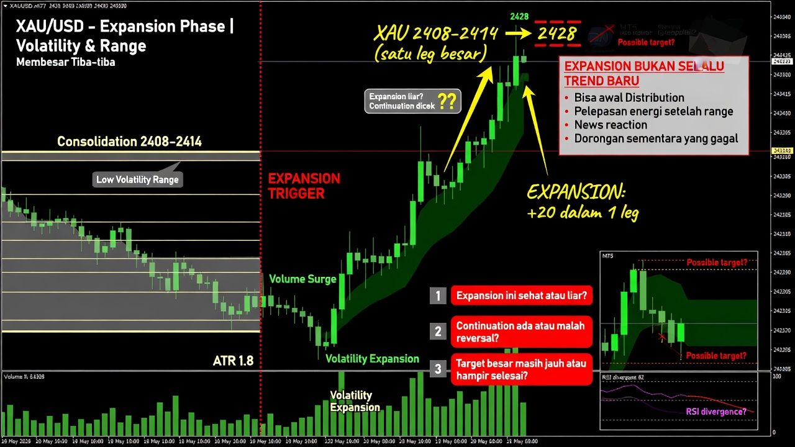
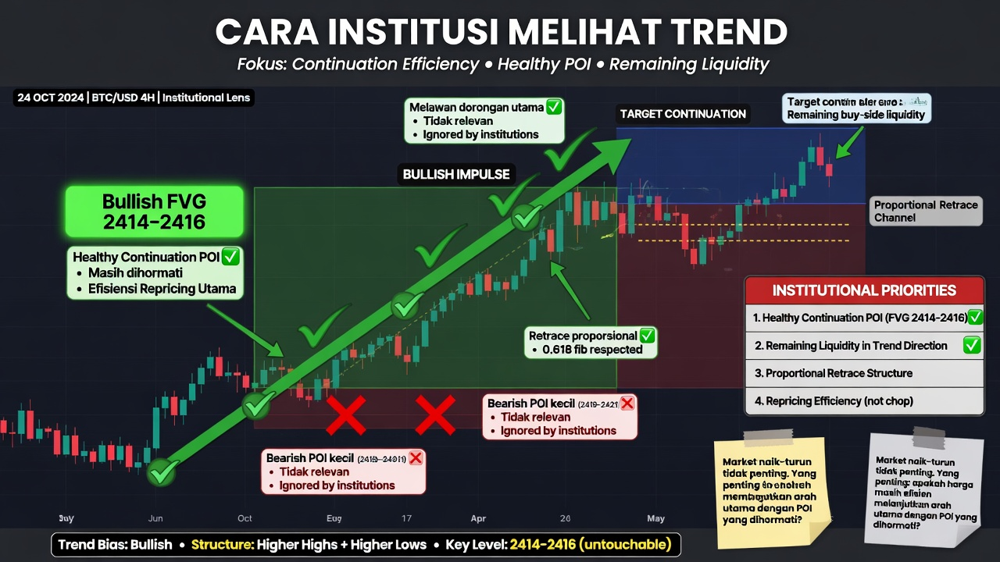
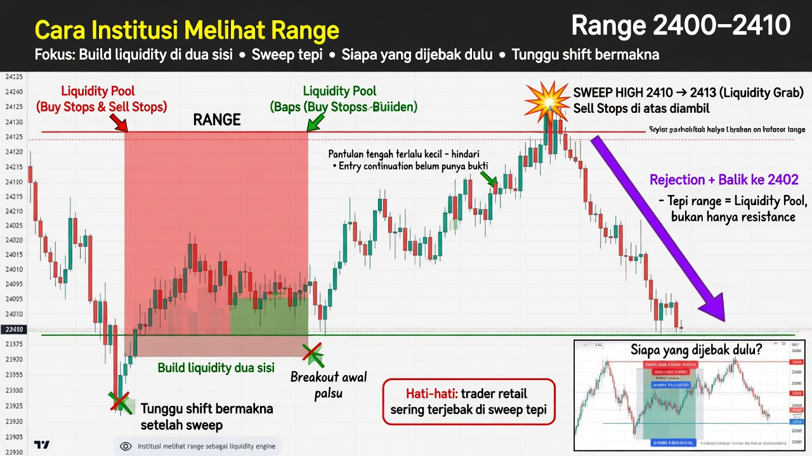
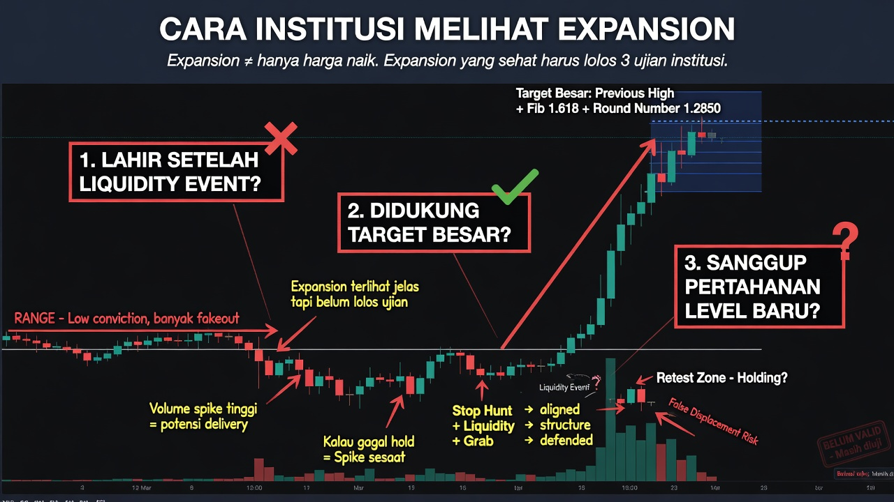

# Bab 10 — Perbedaan Trend, Range, dan Expansion dari Sudut Pandang Institusi

> Banyak trader melihat market hanya sebagai naik, turun, atau diam. Padahal dari sudut pandang yang lebih dalam, **trend, range, dan expansion** bukan sekadar bentuk chart. Tiga kondisi ini adalah tiga **keadaan distribusi harga** yang punya fungsi berbeda. Bab ini penting supaya pembaca tidak membaca semua kondisi market dengan logika yang sama.

## Mengapa Bab Ini Penting

Kesalahan umum trader adalah memaksakan satu cara baca ke semua kondisi:
- market range dibaca seolah sedang trend kuat
- market expansion dibaca seolah akan langsung mean reversion
- market trend dibaca seolah pasti bolak-balik seperti range

Akibatnya:
- entry sering tidak sinkron dengan kondisi market
- target terlalu dekat saat market trend
- atau terlalu jauh saat market range
- trader salah memilih POI dan salah membaca timing

Dari sudut pandang institusi, perbedaan tiga kondisi ini sangat penting karena masing-masing punya fungsi yang berbeda:
- **trend** lebih dekat dengan continuation dan delivery yang terjaga
- **range** lebih dekat dengan build liquidity dan persiapan
- **expansion** lebih dekat dengan pelepasan energi dan perubahan kecepatan market

Kalau pembaca tidak bisa membedakan tiga kondisi ini, maka chart akan terasa membingungkan. Tetapi kalau pembaca bisa mengenali fungsinya, market akan terasa jauh lebih hidup dan lebih logis.

---

## Tujuan Pembelajaran

Setelah mempelajari bab ini, pembaca diharapkan mampu:

- memahami perbedaan trend, range, dan expansion secara lebih dalam
- membaca tiga kondisi ini sebagai perilaku distribusi harga
- memahami bagaimana institusi kemungkinan memanfaatkan masing-masing kondisi
- menyesuaikan cara baca POI, likuiditas, dan entry dengan kondisi market

---

## 1. Trend Bukan Sekadar Harga Naik atau Turun

Dalam cara pandang yang lebih dewasa, **trend** adalah kondisi ketika market mampu mempertahankan arah dominan sambil terus membangun struktur yang mendukung arah itu.

Secara sederhana:
- trend bullish berarti harga masih mampu membentuk **higher high** dan **higher low**
- trend bearish berarti harga masih mampu membentuk **lower high** dan **lower low**

Artinya, trend bukan hanya soal harga sedang bergerak naik atau turun, tetapi soal:
- apakah struktur masih terjaga
- apakah arah dominan masih dihormati
- apakah market masih punya target searah
- apakah retracement masih sehat atau sudah merusak konteks

### Ciri trend bullish
- higher high dan higher low tetap terjaga
- retracement masih sehat
- target atas masih terus terbuka
- market menghormati continuation POI
- buy-side liquidity di atas masih bisa menjadi target berikutnya

### Ciri trend bearish
- lower high dan lower low tetap terjaga
- rally hanya menjadi retrace
- liquidity bawah terus menjadi draw utama
- bearish continuation masih dihormati
- sell-side liquidity di bawah masih terus diburu

### Contoh
XAU naik dari **2400** ke **2430**, retrace ke **2416**, lalu lanjut ke **2442**.  
Ini bukan sekadar harga naik, tetapi **bullish structure** yang masih sehat. Selama struktur itu terjaga, trader tidak seharusnya membaca market seperti range.

---

## 2. Range Bukan Sekadar Sideways Membosankan

**Range** adalah kondisi ketika market belum memberi keputusan arah yang tegas dan justru lebih banyak berputar di antara dua batas harga.

Banyak pemula mengira range adalah market yang “mati”. Padahal dari sudut pandang institusi, range sering sangat berguna untuk:
- mengumpulkan order
- membangun likuiditas di dua sisi
- menciptakan batas high dan low yang jelas
- menyiapkan manipulasi
- menyamarkan niat arah sesungguhnya

Jadi range bukan kondisi kosong. Range sering menjadi tempat market:
- membuat **liquidity pool**
- membangun **range high liquidity**
- membangun **range low liquidity**
- menciptakan **liquidity concentration**
- menyiapkan **inducement** dan jebakan

### Contoh
XAU bergerak di **2398–2412** selama beberapa jam atau bahkan beberapa hari.  
High dan low range makin jelas, dan justru itulah yang membuat range menjadi menarik. Karena semakin jelas batas range, semakin banyak order berkumpul di luar batas itu.

Jadi range bukan kondisi mati. Range adalah **tempat market menyiapkan bahan bakar**.

---

## 3. Expansion Bukan Selalu Trend Baru

**Expansion** adalah fase ketika volatilitas dan range harga membesar. Market tiba-tiba bergerak jauh lebih agresif daripada sebelumnya.

Expansion biasanya ditandai oleh:
- candle lebih besar
- displacement lebih jelas
- range melebar
- kecepatan market meningkat
- arah sesaat terasa lebih tegas

Tetapi expansion tidak selalu otomatis berarti trend baru yang sehat.

Expansion bisa muncul sebagai:
- awal distribution yang kuat
- pelepasan energi setelah range
- reaksi berita
- liquidity run menuju target besar
- atau dorongan sementara yang nanti justru gagal

### Contoh
XAU sebelumnya sempit di **2408–2414**, lalu tiba-tiba meledak ke **2428** dalam satu leg besar.  
Itu adalah expansion.

Tetapi trader tetap harus bertanya:
- expansion ini lahir setelah liquidity event atau tidak?
- expansion ini didukung target besar atau tidak?
- expansion ini sanggup mempertahankan level baru atau tidak?
- expansion ini continuation sehat atau hanya spike sesaat?

Jadi expansion harus diuji, bukan langsung dipercayai.

---

## 4. Cara Institusi Melihat Trend

Dalam trend, fokus utamanya bukan lagi sekadar apakah market naik atau turun, tetapi:
- di mana continuation POI yang paling sehat?
- liquidity mana yang masih tersisa di arah trend?
- apakah retrace masih proporsional?
- apakah market masih menghormati struktur?

Artinya, dalam trend, institusi lebih tertarik pada **continuation** dan **delivery**, bukan pada pantulan kecil yang melawan arah utama.

Kalau market bullish dan masih menghormati bullish FVG di **2414–2416**, maka area itu jauh lebih penting daripada bearish POI kecil yang hanya melawan dorongan utama.

Dari sisi glosarium:
- trend yang sehat biasanya masih menjaga **bullish structure** atau **bearish structure**
- targetnya masih mengikuti **draw on liquidity**
- pullback sehat sering menjadi bagian dari **retracement**, bukan reversal
- continuation yang baik sering lahir setelah **rebalancing** atau **price rebalancing**

Jadi dalam trend, cara baca yang sehat adalah:
- hormati arah dominan
- fokus pada continuation model
- jangan terlalu cepat memburu reversal kecil

---

## 5. Cara Institusi Melihat Range

Dalam range, fokus utamanya sering berpindah ke:
- build liquidity di dua sisi
- sweep di tepi atas atau bawah
- mencari siapa yang dijebak dulu
- menunggu shift yang benar-benar bermakna

Jadi dalam range, trader harus jauh lebih hati-hati terhadap:
- breakout awal
- pantulan tengah range yang terlalu kecil
- entry continuation yang belum punya bukti kuat

### Contoh
Range di **2400–2410**.  
Kalau high **2410** disapu ke **2413**, lalu market balik turun ke **2402**, trader mulai melihat bahwa fungsi utama tepi range bukan sekadar resistance, tetapi **liquidity pool**.

Dalam bahasa yang lebih teknis:
- range sering menjadi tempat **liquidity build**
- tepi atas dan bawah range sering menjadi **internal liquidity** atau pintu ke **external liquidity**
- breakout awal bisa berubah menjadi **liquidity sweep** atau **liquidity fakeout**
- arah final sering baru jelas setelah market selesai melakukan manipulasi

Jadi dalam range, trader tidak boleh memakai logika trend mentah-mentah.

---

## 6. Cara Institusi Melihat Expansion

Expansion sering dibaca sebagai fase ketika market **menunjukkan niat** lebih jelas daripada fase range. Tetapi expansion yang sehat tetap harus diuji.

Pertanyaan pentingnya:
- expansion ini lahir setelah liquidity event atau tidak?
- expansion ini didukung target besar atau tidak?
- expansion ini sanggup mempertahankan level baru atau tidak?
- expansion ini punya follow-through atau langsung habis?

Kalau jawabannya ya, expansion bisa menjadi awal delivery penting.  
Kalau tidak, expansion bisa berubah menjadi:
- false displacement
- spike sesaat
- fake breakout
- atau move yang cepat tetapi tidak punya kelanjutan

Dalam istilah yang lebih dalam:
- expansion sehat sering dekat dengan **algorithmic expansion**
- expansion yang punya tujuan biasanya mengikuti **liquidity path**
- expansion yang matang sering berlanjut menjadi **momentum delivery**
- expansion yang gagal bisa berakhir sebagai **imbalance failure** atau **liquidity reversal**

Jadi expansion bukan untuk dikejar secara buta. Expansion harus dibaca fungsinya.

---

## 7. Kenapa Trader Sering Salah Baca?

Karena trader melihat **bentuk**, tetapi belum melihat **fungsi**.

### Saat trend
Trader terlalu cepat mencari reversal kecil, padahal market masih punya target searah yang jelas.

### Saat range
Trader terlalu cepat percaya breakout, padahal market justru sedang membangun likuiditas untuk sapuan berikutnya.

### Saat expansion
Trader terlalu cepat menganggap move besar pasti sehat, padahal bisa saja itu hanya pelepasan energi singkat tanpa continuation.

Padahal tiap kondisi harus dibaca dengan pertanyaan yang berbeda.

---

## 8. Cara Menyesuaikan Pembacaan

### Saat trend
- fokus continuation
- hormati retrace sehat
- target bisa lebih jauh
- lihat apakah draw on liquidity masih searah
- cari continuation POI yang mendukung struktur

### Saat range
- hormati tepi range
- curigai false break
- tunggu liquidity event + shift
- jangan terlalu percaya breakout awal
- lihat siapa yang sedang dijebak

### Saat expansion
- cek apakah ini delivery sehat atau spike liar
- cek follow-through
- cek target besar dan continuation berikutnya
- lihat apakah expansion didukung struktur dan likuiditas

Dengan cara ini, trader tidak lagi memakai satu logika untuk semua market.

---

## 9. Kesalahan Umum

### 1) Menganggap semua market yang diam sebagai tidak penting
Padahal range sering paling kaya likuiditas.

### 2) Menganggap expansion otomatis berarti trend sehat
Padahal bisa saja hanya spike sesaat.

### 3) Memakai target range untuk market trend
Ini membuat hasil terlalu kecil.

### 4) Memakai logika trend di market range
Ini membuat trader terlalu sering kena jebakan.

### 5) Tidak membedakan retracement sehat dengan perubahan struktur
Akibatnya trader keluar terlalu cepat atau masuk melawan konteks.

---

## 10. Ringkasan Bab

Inti bab ini adalah:

- trend, range, dan expansion adalah tiga kondisi market dengan fungsi yang berbeda
- trend lebih dekat dengan continuation dan delivery yang terjaga
- range lebih dekat dengan build liquidity dan manipulation
- expansion lebih dekat dengan pelepasan energi, tetapi tetap harus diuji kualitasnya
- trader perlu menyesuaikan cara baca dengan kondisi market, bukan memakai satu logika untuk semuanya

---

## Penutup

Saat pembaca mulai memahami perbedaan trend, range, dan expansion dari sudut pandang institusi, chart akan terasa jauh lebih hidup. Ia tidak lagi melihat market sebagai bentuk statis, tetapi sebagai kondisi distribusi harga yang berganti-ganti fungsi.

Dan dari perubahan cara pandang itulah pembacaan market menjadi lebih dewasa.

---

## Catatan

Materi ini bersifat edukatif dan bukan rekomendasi finansial. Gunakan untuk membangun kemampuan membedakan kondisi market dan menyesuaikan cara baca secara lebih tepat.
